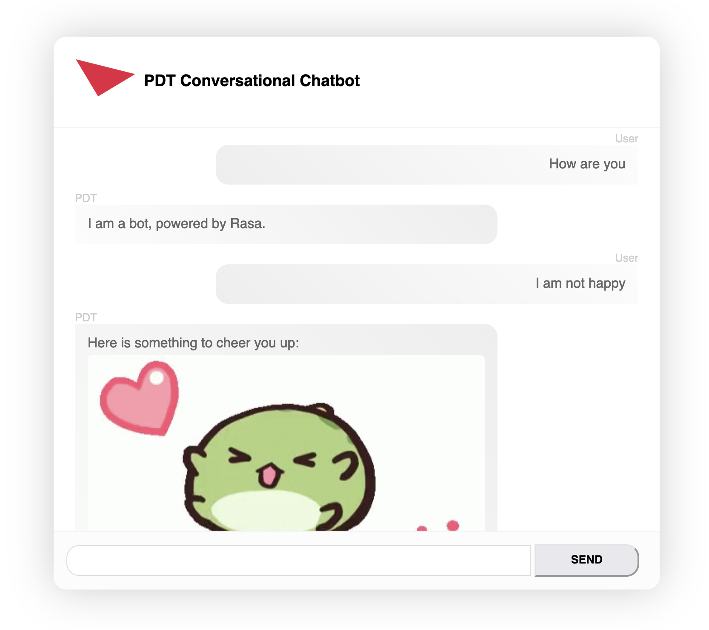

# PDT Conversational AI
A Conversational AI Assistance built on Python and Rasa to act as a PDT and provide emotional support using Sentiment Analysis.



To get started testing the PDT Chatbot on your system, make sure you have Rasa setup. For guide on how to setup Rasa, please visit [Rasa Open Source Doc](https://rasa.com/docs/rasa/).

You can rather pull this repo on your system, by following the below:

## Run Locally

Clone the project

```bash
  git clone https://github.com/iyinusa/PDT-bot.git
```

Go to the project directory

```bash
  cd PDT-bot
```

Install Rasa/dependencies

```bash
  rasa init
```

Train the model, and anytime you update the NLU pipeline

```bash
  rasa train
```

To now be able to launch the Chatbot Interface, you will need to start the Rasa Server, and Python HTTP Server.

To start Rasa Server

```bash
  rasa run --enable-api --cors "*"
```

Ensure the the flag `--cors "*"` is included to allow request acceptance for any sources, or you can define your sources, by replace it with the "*"

Once started, you will have access to the API URI, which will look like `http://localhost:5005`. You will need that for the API requests/responses.

To start Python HTTP Server

```bash
  python -m http.server
```

Once started, you can then go to your browser, and type `http://localhost:8000`. Please check terminal if port is different.

Finally, you will now be able to test and start having conversation with the Chatbot.

## Contributors

Meet the project contributors.
| | | |
|:-------------------------:|:-------------------------:|:-------------------------:|
| [](https://github.com/adarmudas/profile)<br />Aaron Darmudas</sub> |

[<br /><sub><ahref="https://github.com/iyinusa">I. Kennedy Yinusa</a></sub>](https://github.com/iyinusa/profile)

[<br /><sub><ahref="https://github.com/yeshwasri">yeshwasri</a></sub>](https://github.com/yeshwasri/profile)

[<br /><sub><ahref="https://github.com/astogunsola">astogunsola</a></sub>](https://github.com/astogunsola/profile)

[<br /><sub><ahref="https://github.com/Saw6205">Saw6205</a></sub>](https://github.com/Saw6205/profile)

[<br /><sub><ahref="https://github.com/Saw6205">Saw6205</a></sub>](https://github.com/Saw6205/profile)

[<br /><sub><ahref="https://github.com/yab55">yab55</a></sub>](https://github.com/yab55/profile)
